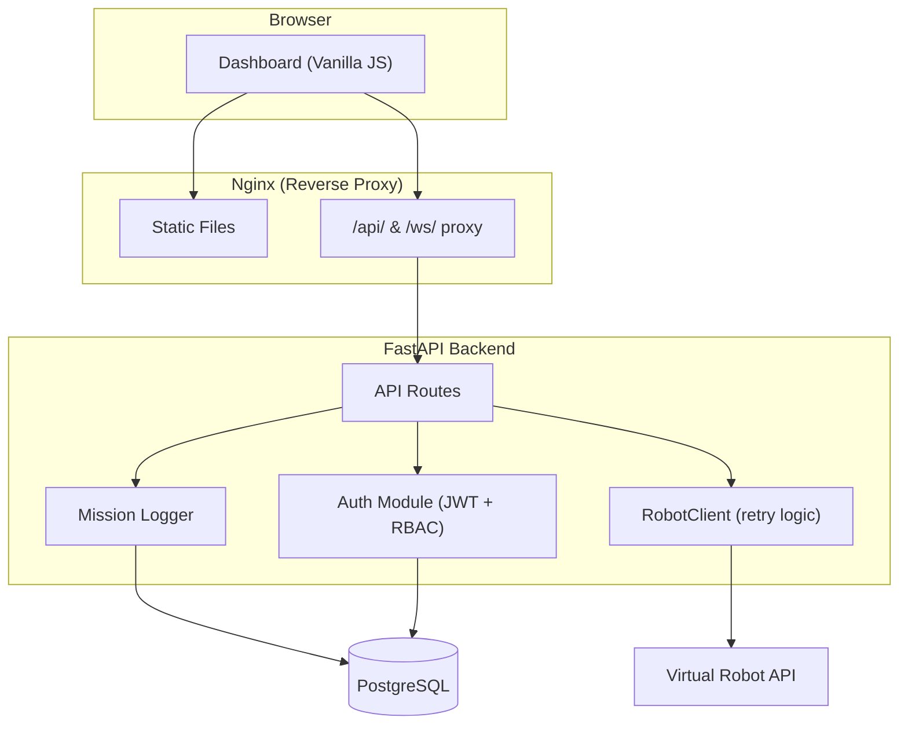

# Architecture Overview

This project uses a **vanilla JavaScript frontend** with a **Python (FastAPI) backend** and follows a **layered architecture with client-server principles**.

## System Components

| Component | Technology | Responsibility |
|-----------|-----------|----------------|
| Frontend | Nginx 1.27 + Vanilla JS | Dashboard UI, authentication flow, RBAC-driven controls |
| Backend | Python 3.12, FastAPI, httpx | REST API, JWT authentication, RBAC enforcement, mission logging |
| Database | PostgreSQL 16 (SQLAlchemy ORM) | User accounts, mission audit trail |
| Robot API | Docker container (provided) | 21x21 grid simulation, sensors, battery physics |

## Architecture Pattern

The **View layer** is handled by a single-page vanilla JavaScript application served by Nginx. Nginx also acts as a **reverse proxy**, routing `/api/` and `/ws/` paths to the backend, keeping a single origin and eliminating CORS issues.

The **Controller layer** is implemented using FastAPI route handlers, which accept HTTP requests, validate input via Pydantic models, enforce RBAC via dependency injection, and delegate to services.

The **Service layer** consists of the `RobotClient` (async HTTP client with exponential-backoff retry) and the `auth` module (JWT issuance and validation, bcrypt password hashing).

The **Model layer** uses SQLAlchemy ORM models (`User`, `MissionLog`) mapped to PostgreSQL tables, covering user accounts with role-based access and a persistent command audit trail.

## Architecture Diagram

## Key Design Patterns

- **Proxy Pattern**: Nginx reverse proxy decouples frontend from backend internals
- **Retry with Exponential Backoff**: RobotClient handles 503 chaos-monkey errors
- **Singleton**: Module-level RobotClient instance shared across all requests
- **Dependency Injection**: FastAPI's `Depends()` for auth guards, DB sessions
- **Observer**: WebSocket telemetry pushes status updates to connected clients
- **Repository**: SQLAlchemy session management via `get_db()` dependency

## Security

- JWT Bearer tokens with configurable expiry
- bcrypt password hashing (passlib)
- RBAC: Viewer (read-only) vs Commander (move/reset commands)
- Non-root container user in production Docker image
- Security headers via Nginx (X-Frame-Options, X-Content-Type-Options)
- Pydantic input validation on all endpoints
